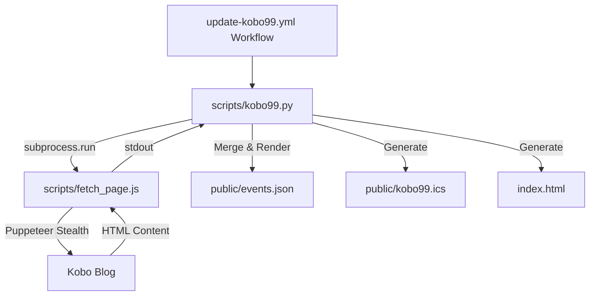

# Kobo 99 選書行事曆 (ICS) - Agent 維護指南

此文件專為 AI 助理 (Agent) 設計，記錄了本專案的架構、技術細節、運作機制以及本機開發與除錯的常用指令，方便後續維護與功能擴充。

---

## 1. 專案概述與目標
自動化爬取樂天 Kobo 官方部落格「一週 99 元選書」的文章，解析每日特價書籍的網址與日期，並將其輸出為供 Google Calendar 等軟體訂閱的 `.ics` (iCalendar) 行事曆檔案、`events.json` 累積資料庫以及靜態首頁 `index.html`。

---

## 2. 技術架構
本專案採用 **Python + Node.js 雙執行環境** 的複合架構：

- **Python (3.12+)**:
  - 負責執行主程式 [kobo99.py](file:///Users/oshukezu/Documents/Knowledge%20Vault/Codex/KOBO99-ics/scripts/kobo99.py)。
  - 處理參數解析、歷史資料合併、HTML 標記解析（`HTMLParser`）、優惠日期推算、`.ics` 行事曆生成以及 `index.html` 的靜態網頁渲染。
- **Node.js (24+)**:
  - 負責執行輔助網頁爬取腳本 [fetch_page.js](file:///Users/oshukezu/Documents/Knowledge%20Vault/Codex/KOBO99-ics/scripts/fetch_page.js)。
  - 利用 `puppeteer-extra` 搭配 `puppeteer-extra-plugin-stealth` 啟動無頭瀏覽器，以繞過 Kobo 網站的 **Cloudflare 反爬蟲機制與動態載入**。



---

## 3. 防封鎖（Stealth）設計要點
1. **Node.js 爬取**: Python 直接以 `urllib` 或一般的無頭瀏覽器抓取極易觸發 Cloudflare 的阻擋（出現 "Direct fetch blocked"）。因此，本專案將瀏覽器抓取部分外包給 Node.js。
2. **Stealth 插件**: `fetch_page.js` 啟用了 `puppeteer-extra-plugin-stealth`，抹除無頭瀏覽器特徵。
3. **安全結束進程**: 在 Node.js 中，為了避免 stdout 緩衝區內的 HTML 數據尚未完全寫入就被 `process.exit(0)` 強行終止（導致 Python 端發生 `unexpected end of data` 的 UTF-8 解碼錯誤），我們在 `process.stdout.write` 的 callback 中執行退出：
   ```javascript
   process.stdout.write(content, () => {
     process.exit(0);
   });
   ```
4. **解碼容錯**: Python 的 `subprocess.run` 在讀取 stdout 時加上了 `errors="replace"`，確保即便因極端狀況導致尾端編碼有些微異常，依然能正常解析。

---

## 4. 常用維護與測試指令

### 本機安裝 Node 依賴
```bash
npm install puppeteer puppeteer-extra puppeteer-extra-plugin-stealth
```

### 測試抓取特定週的選書 (以 2026 年第 23 週為例)
使用 `--strict` 參數可以在出錯時立即拋出異常，便於排查問題：
```bash
python3 scripts/kobo99.py --year 2026 --week 23 --fetch-mode browser --strict
```

### 本機完整同步
```bash
python3 scripts/kobo99.py --out public
```

---

## 5. GitHub Actions 設定
GitHub Actions 工作流配置於 [.github/workflows/update-kobo99.yml](file:///Users/oshukezu/Documents/Knowledge%20Vault/Codex/KOBO99-ics/.github/workflows/update-kobo99.yml)：
- **執行時間**：每週四台北時間早上 07:00（UTC 時間週三 21:00）自動定時執行。
- **環境設定**：
  - Python: `3.12`
  - Node.js: `24`
- **自動部署**：自動將整個專案根目錄部署到 GitHub Pages。